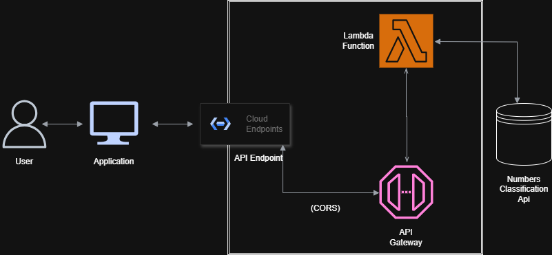

TECHNICAL ARCHITECTURAL DRAWING

# Number Classification API Documentation
## Project Overview
This project provides a serverless solution for classifying numbers and fetching interesting facts about them using AWS Lambda, API Gateway, and the Numbers API.

## Key Features:
1. Number Classification: Identifies properties of numbers, such as whether they are prime, perfect, or Armstrong.
2. Fun Fact Retrieval: Fetches fascinating facts about user-inputted numbers from the Numbers API.
3. Serverless Architecture: Utilizes AWS Lambda and API Gateway for scalable backend operations.
3. User-Friendly Frontend: A simple web interface where users can input a number and instantly receive results.    

## How It Works:
1. The user enters a number in the frontend application.
2. A request is sent via API Gateway to trigger the Lambda function.
3. The Lambda function processes the request by:
Analyzing the number's properties (e.g., prime, perfect, or Armstrong).
4. Fetching a fun fact from the Numbers API.
5. The response is displayed on the user interface, including the number properties and fun fact.

## Project Structure:
1. lambda.py: The main Lambda function script that handles number classification and external API integration.
2. Frontend: Simple HTML and JavaScript-based interface for user interaction.
3. AWS API Gateway: Manages API requests and routes them to the Lambda function.

## How to Run the Project:
### Deploy the Lambda Function:
Upload lambda.py to your AWS Lambda instance.
Configure the Lambda function to trigger via API Gateway.

### Frontend Setup:
Open the frontend HTML file in a browser.
Enter a number and submit.
### View Results:
See the number's classification and fun fact displayed on the screen.

## Technologies Used:
1. AWS Lambda
2. API Gateway
3. Python (for the Lambda function)
4. Numbers API
5. HTML, CSS, and JavaScript for the frontend

## API END-pOINT

URL : https://24f4plfe8f.execute-api.us-east-1.amazonaws.com/api/classify-number?number=70